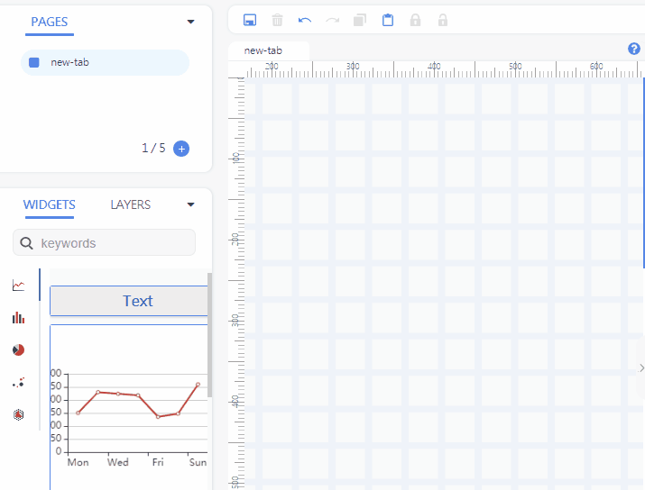
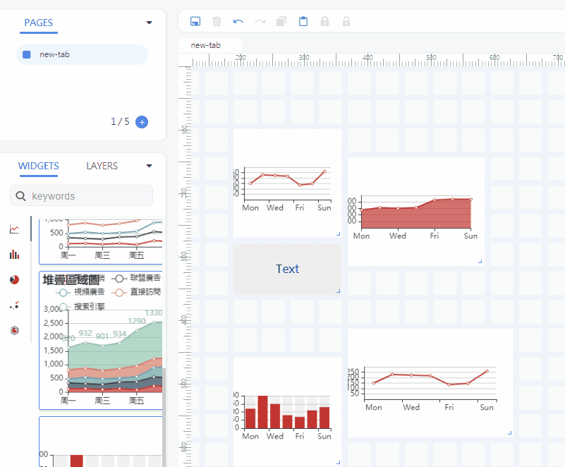
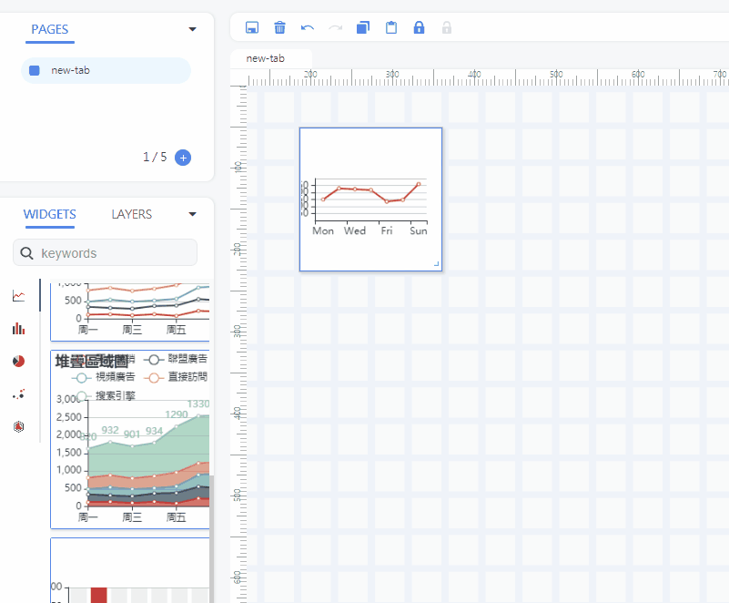
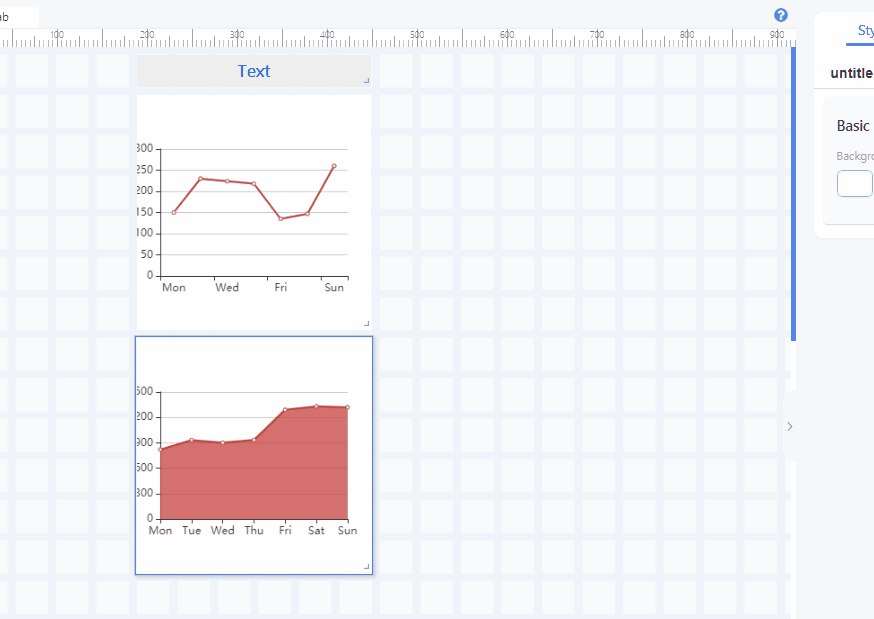

# dashboard+ 線上數據可視化儀表編輯器
> 原文連結 https://mike-zheng.github.io/posts/jb49vj20

## 前言

這幾年的前端框架使用，開始漸漸以`vue`為主。基本上主流的3大框架都略有涉略，但使用`vue`的主要原因不外乎是他與`AngularJS`(第一代框架)的學習曲線很接近，且對與`TypeScript`這種可能某一天會像`CoffeeScript`突然消失的前處理語言不感興趣(雖然目前看起來是短期不會這麼容易被淘汰😆)。
寫著寫著呢，慢慢也就開始推坑給同學，最後甚至帶進了目前的公司，公司全線新開發的前端到後來也全都是`vue`。

### 進階的前端應用程式

> 進階的前端應用程式 -> 應用程式等級的雲端編輯器

除了在前公司有過`AngularJS`的線上投影片編輯器經驗外，老實說，目前大部分的日常開發不外乎是表單、表格等等清單操作，再透過ajax到backend api，進而與機器內部進行通訊。

看著web領域充斥著大神，自己卻在工業領域發展產品業務為主的工作內容，其實也會開始想有機會以純前端為主的應用程式開發。

### 數據可視化儀表板

"數據可視化儀表板"碰到這個詞我會聯想到大學期間修課聽到的"資料視覺化"，但是近年來對岸的前端實力實在非比尋常，工控產業也好，前端開發也好，用詞漸漸都對齊了大眾詞，畢竟對岸人口又多，實力又強。

"數據可視化儀表板"

我想這個標題這樣定，應該是比"資料視覺化編輯器"還要精確吧

## Demo
畢竟這篇是作品展示，也算是求職用途，先讓看倌看看demo

https://mike-zheng.github.io/dashboard/

去年底開始從框慢慢開始加上過年連假的衝刺，把以前的技術跟模塊整合，零碎時間湊一湊每天寫一點算是開發了好幾個月。

### 為什麼開發線上數據可視化儀表板編輯器

主要還是因為工作上接觸了

- 阿里雲 物聯網應用開發（IoT Studio） [物联网开发服务(IoT Studio) - 阿里云IoT](https://cn.aliyun.com/product/iotstudio)
- [Azure 監視器的資料視覺化 dashboard儀表板](https://docs.microsoft.com/zh-tw/azure/azure-monitor/visualize/tutorial-logs-dashboards)
- [百度智能雲 數據可視化Sugar平台](https://cloud.baidu.com/product/sugar.html)

覺得自己也有辦法能夠獨自完成線上的編輯工具，於是才開始了這次的作品計畫。

📊📈📉

不過當然我並沒有處理資料流😆 ，當作未來feature吧。

--------------------------------
## 功能特色

demo連結: https://mike-zheng.github.io/dashboard/

----------------------------------

- 拖曳添加元件
  - 透過滑鼠的拖曳將元件加入編輯畫布之中，主要就跟早期的[salesforce](https://www.salesforce.com/tw/)dashboard類似，或者是[Azure]((https://docs.microsoft.com/zh-tw/azure/azure-monitor/visualize/tutorial-logs-dashboards))。

- 組件的元素調整
  - 這邊採用的策略希望是所見即所得WYSIWYG的策略，而非跳出選單編輯不能同時觀看調整的屬性。

- 多選+拖曳
  - 基本上多選與移動再各大作業系統UI上都是主流操作，因此將模組重新patch，將多選與移動加入。

- 複製貼上
  - 複製節點的snapshot並存於store 上，貼上時再透過store的流程clone一份。 

- 右鍵context menu
  - 一般網頁操作比較沒有實作的部分，將選單的內容放入並加入邏輯判斷是否能使用。

- tab 分頁系統
  - 主流dashboard都實作了，感覺這應該是編輯器的基本 

- ZoomIn/ZoomOut
  - 這個裡面就複雜了一些。 ~~關於這個內容下次再做視頻的視頻我們下次再做視頻給大家講解~~ (誤)

- 功能列 + menu
    - 復原重作 undo redo
    - 鎖定功能 lock unlock
    - 刪除功能 delete
    - 存檔功能 save 

- 快捷鍵
  * 選取後刪除 Delete / Backspace
  * 單選複製貼上 Ctrl +V / Ctrl +V
  * 復原重作 Ctrl +Z / Ctrl +Y
  * 畫布移動 space + mouse move

- 多國語系
  - 把vue i18n 實作進去 

- 選單功能

- 預覽展示
  - 將整個編輯的editor file snapshot存入localstorage中

--------------------------------
## 組件
重覆造輪其實在工程師業界，尤其是前端領域是一個不錯的學習法。但開發者必須全面思考，有些情況當然需要靠著萬能的npm(Node Package Manager)。
這邊來列舉我用到的套件們以及其調整的項目

-  Vue.js (vue + vuex + vue-router + vue-cli + vue-i18n) + element-ui
    - 基礎框架當然就是vue https://vuejs.org/
    - 然後對岸社群都講 Vue 全家桶 + [element](https://github.com/ElemeFE/element)

-  [vue-grid-layout](https://github.com/chuxiaoguo/vue-grid-layout)
    - 最核心的部分為 https://github.com/chuxiaoguo/vue-grid-layout
    - 這個模塊，不過由於開發後的需求，不得已將其fork下來另外加入功能。
    - 調整功能如下
      - 整合 [selection](https://github.com/Simonwep/selection) 加入選區框
      - 在內部加入多選移動的patch
      - 新增一個prop並於模塊內部實作zoom的控制
-  [echarts](https://echarts.apache.org/zh/cheat-sheet.html)
    - 這個圖表框架想必大家都認識，從百度團隊出品的後加入 Apache Software Foundation的Echart。
    - 大概也是被百度智能雲 數據可視化Sugar平台 燒到 才挑選這樣的組件
-  右鍵contextmenu
    - 右鍵contextmenu是挑選這款[v-contextmenu](https://github.com/heynext/v-contextmenu)小巧靈活的組件，相對也不會太臃腫。
-  其他
這邊再把幾格看的到的列出來
    - [monaco-editor](https://github.com/microsoft/monaco-editor) vscode的核心
    - [vue-file-toolbar-menu](https://github.com/motla/vue-file-toolbar-menu) 簡單小巧的toolbar menu

-----------------------------
## 小記

其實除了輪子組件之外，還有非常多內部我自己實作的部分，
像是"undo redo的策略" 或是 "資料與UI流程的導向 "，
礙於篇幅就先這樣吧，近期因為諸多因素大概是會換個工作。

待順利找到新工作，

假日也有空檔再把一些實作的細節另外寫一篇跟大家分享。

也歡迎大家推薦工作給我😆。

--------------------------------
https://mike-zheng.github.io/dashboard/
----------------------------------